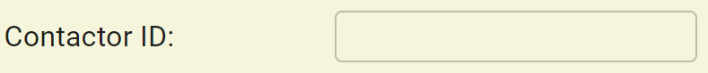
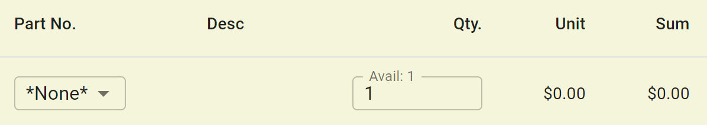
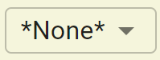
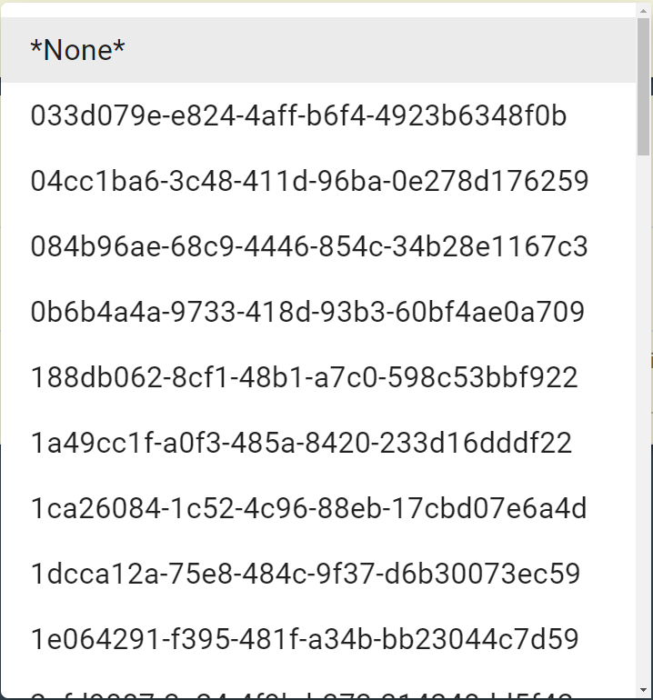
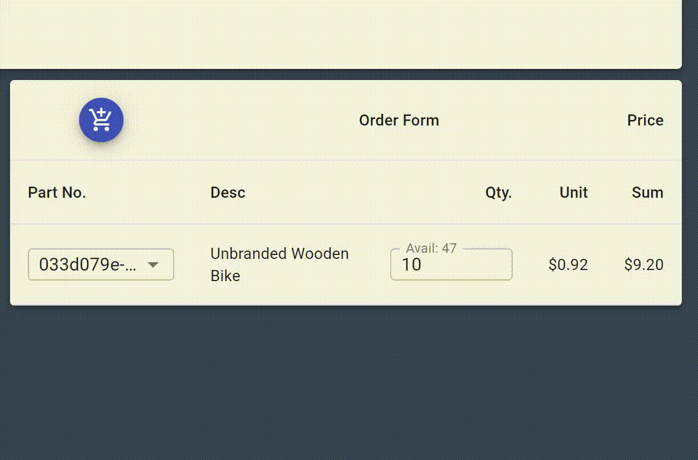
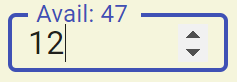
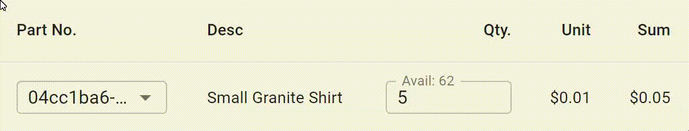
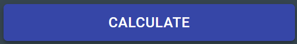
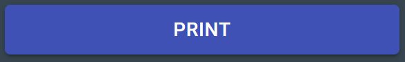
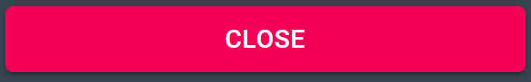

# Warehouse Point-of-Sale

:w

     

A mock application for a warehouse point-of-sale. This project uses [React.js](https://facebook.github.io/create-react-app/docs/getting-started), [Material-UI](https://material-ui.com/), [Hooks](https://reactjs.org/docs/hooks-intro.html), [Immer](https://immerjs.github.io/immer/) for context, and [JSON Server](https://github.com/typicode/json-server) to reflect a back-end RESTful service providing data to the front-end.

## How to Use

1. Type your contractor ID in the text field and hit the [Enter] key on desktop or [Return] on mobile. The contractor IDs correspond to the company's stock symbol.

1. Add product(s) using the AddToCart Button

   1. A new row will be added to the cart.

   

   1. The `*None*` represents no product selected.

   

   1. The desired product Part No. must be selected.

   

   1. You can remove a product by re-selecting `*None*` from the currently selected product.

   

1. Modify the quantity using the text field
   1. The available inventory for the product is shown as "Avail: X" where X is the current inventory.

   

   2. Quantities greater than the available inventory are not permitted to be inserted.
   3. If the quantity is set to zero then the product is removed from the cart.

   

1. Hit the calculate button when the cart is finalized.

5. Optional, hit the print button to print an invoice.

6. When finished, hit the Close button. PLEASE NOTE: All data will be reset when clicking.

Example Contractors:
* { "id": "AAPL", "company": "Apple Inc.", "name": "Tim Cook", "discount": 0.8 }
* { "id": "AMZN", "company": "Amazon.com", "name": "Jeff Bezos", "discount": 0.83 }
* { "id": "AXP", "company": "American Express", "name": "Stephen Squeri", "discount": 1.0 }
* { "id": "BRK-A", "company": "Berkshire Hathaway", "name": "Warren Buffett", "discount": 0.12 }
* { "id": "KO", "company": "Coca-Cola", "name": "James Quincey", "discount": 0.01 }

# Mocking

An accompanying repository [warehouse-api](https://github.com/crsiebler/warehouse-api) is provided for mocking the back-end application. This is only necessary when running locally. Change directory into that repository and run the following:

### `yarn start`

## Available Scripts

In the project directory, you can run:

### `yarn start`

Runs the app in the development mode.\
Open [http://localhost:3000](http://localhost:3000) to view it in the browser.

The page will reload if you make edits.\
You will also see any lint errors in the console.

### `yarn test`

Launches the test runner in the interactive watch mode.\
See the section about [running tests](https://facebook.github.io/create-react-app/docs/running-tests) for more information.

### `yarn build`

Builds the app for production to the `build` folder.\
It correctly bundles React in production mode and optimizes the build for the best performance.

The build is minified and the filenames include the hashes.\
Your app is ready to be deployed!

See the section about [deployment](https://facebook.github.io/create-react-app/docs/deployment) for more information.

### `yarn eject`

**Note: this is a one-way operation. Once you `eject`, you can’t go back!**

If you aren’t satisfied with the build tool and configuration choices, you can `eject` at any time. This command will remove the single build dependency from your project.

Instead, it will copy all the configuration files and the transitive dependencies (webpack, Babel, ESLint, etc) right into your project so you have full control over them. All of the commands except `eject` will still work, but they will point to the copied scripts so you can tweak them. At this point you’re on your own.

You don’t have to ever use `eject`. The curated feature set is suitable for small and middle deployments, and you shouldn’t feel obligated to use this feature. However we understand that this tool wouldn’t be useful if you couldn’t customize it when you are ready for it.
